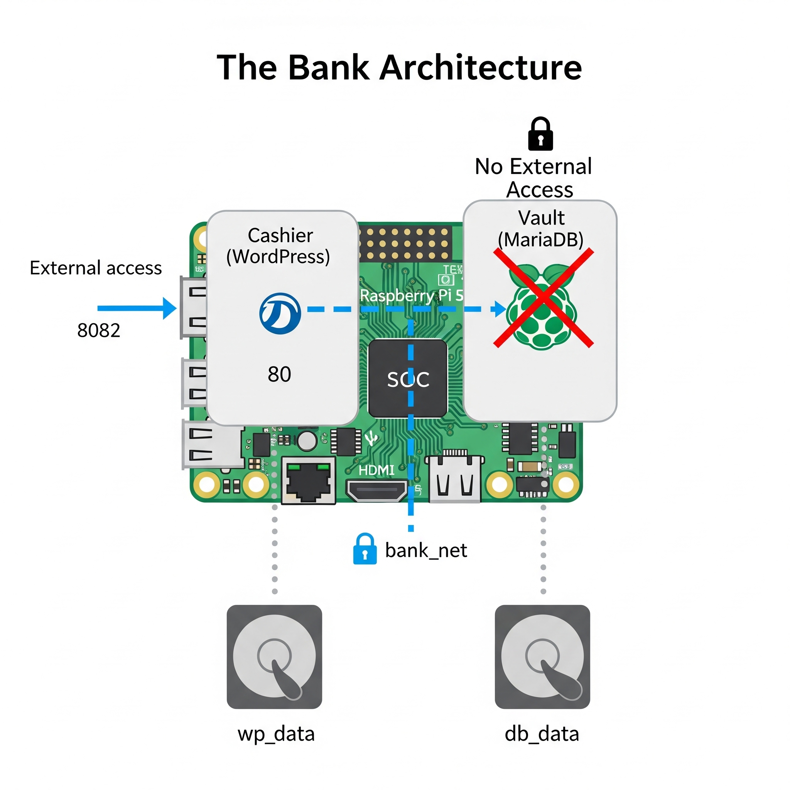
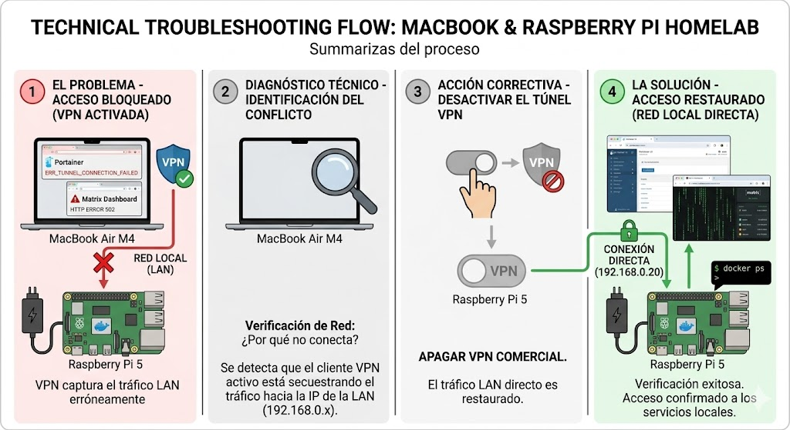

# 🐳 Fase 3: Docker y Kubernetes

Validierung (Smoke Test)
Deployment des hello-world Containers.


## 1. Container Runtime & Identity Management

Nach der Stabilisierung der Hardware-Ebene (Layer 1) und des Betriebssystems (Layer 2) erfolgte die Konfiguration der logischen Identität und die Implementierung der Container-Virtualisierungsschicht.

### DNS & Hostname Konfiguration (Local Resolution)
**Ziel:** Eliminierung der Abhängigkeit von flüchtigen IPs und Etablierung einer logischen Nomenklatur (`node-01`, `proxmox`).
* Implementierung einer statischen Namensauflösung via `/etc/hosts`.
* Permanente Änderung der Hostnamen mittels `hostnamectl`.
* **Ergebnis:** Reibungslose Kommunikation via FQDN-Simulation.

### Installation der Docker Engine (Enterprise Standard)
**Ziel:** Bereitstellung einer sicheren Container-Laufzeitumgebung.
* Download und Installation des offiziellen **Docker GPG Keys** in `/etc/apt/keyrings/docker.gpg`.
* **Installierte Artefakte:** `docker-ce`, `docker-ce-cli`, `containerd.io`, `docker-buildx-plugin`, `docker-compose-plugin`.

### Rechteverwaltung (Privilege Management)
**Ziel:** Operatives Container-Management ohne permanente Root-Rechte.
```bash
sudo usermod -aG docker $USER


### 🚀 2. Web-Server Deployment & Remote-Development Workflow
Einrichtung der Entwicklungsumgebung (IDE Setup)
Ziel: Implementierung eines "Remote-SSH" Workflows, um Code lokal auf dem Mac (VS Code) zu schreiben und direkt auf der Raspberry Pi auszuführen.

# ~/.ssh/config (macOS Client)
Host pi5-node-01
    HostName 192.168.0.20
    User robert
    IdentityFile ~/.ssh/id_rsa


### Container Deployment (Nginx)
Bereitstellung des Webservers unter Verwendung von Bind Mounts und Port Mapping.

docker run -d \
  --name mi-web-server \
  -p 8080:80 \
  -v ~/mainz-web/index.html:/usr/share/nginx/html/index.html:ro \
  nginx

  


### 🚀 3. Praxis-Guide: Aufbau eines Mini-Clusters mit Portainer

Wir verwenden den Raspberry Pi 5 als "Kontrollturm" (Manager) und den Raspberry Pi 4 als "Arbeitsknoten" (Worker).

Schritt 1: Den Worker-Knoten vorbereiten (Raspberry Pi 4)
Installiere den Portainer Agent: 
docker run -d \
  -p 9001:9001 \
  --name portainer_agent \
  --restart=always \
  -v /var/run/docker.sock:/var/run/docker.sock \
  -v /var/lib/docker/volumes:/var/lib/docker/volumes \
  portainer/agent:latest


Schritt 2: Die Knoten verknüpfen (Im Browser)
Öffne Portainer in deinem Browser: https://pi5-node-01:9443.

Gehe zu Environments > + Add environment.

Wähle Docker Standalone aus und klicke auf Connect a remote node (Option Agent).

Fülle das Feld Name mit Pi4-Worker und Environment address mit [IP_DEINES_PI4]:9001 aus. Connect.

### 🏛️ Architektur-Zusammenfassung
Manager-Knoten (Pi 5): Das ist das Gehirn. Hier befindet sich die Weboberfläche von Portainer.

Worker-Knoten (Pi 4): Das sind die Muskeln. Er führt die Container aus.

### 🏗️ 4. Infraestructura como Código (IaC): Portainer Stacks
"Nunca hagas a mano lo que puedas automatizar y versionar"

Concepto Clave: Un "Stack" en Portainer es exactamente un archivo docker-compose.yml, pero gestionado, editado y ejecutado directamente desde la interfaz web, sin necesidad de entrar por SSH a la terminal de tu servidor.

🖼️ Arquitectura Visual de un Stack

[ TÚ (DevOps) ]
       │
       ▼
[ PORTAINER (Panel Web) ] ── Escribes o pegas tu código YAML aquí.
       │
       ├─► (Orden enviada) ─► [ RASPBERRY PI 5 (Manager) ] ─► Despliega Contenedor A
       │
       └─► (Orden enviada) ─► [ RASPBERRY PI 4 (Worker) ]  ─► Despliega Contenedor B

¿Por qué usar STACK? Si el sistema de mi PC se rompe, el código estará guardado en el Portainer de mi Pi 5 y disponible para ser usado.

🛠️ El Laboratorio: Tu Primer Stack Paso a Paso
Vamos a desplegar una aplicación web llamada nginxdemos/hello en tu Pi 4.

Paso 1: Seleccionar el nodo
Al seleccionar la Pi 4 en Portainer, todo lo que hagamos afectará solo a ese hardware.

Paso 2: Ir a la sección de Stacks
Haz clic en Stacks y luego en el botón + Add stack.

Paso 3: Definir la Infraestructura como Código
Ponle de nombre mi-primer-stack. Pega este código exacto:
version: '3.8'

services:
  web-diagnostico:
    image: nginxdemos/hello:latest
    container_name: app-diagnostico-pi4
    restart: unless-stopped
    ports:
      - "8085:80"

El Porqué (Línea por línea):

version: '3.8': Vocabulario de Compose.

services:: Lista de aplicaciones.

web-diagnostico:: Nombre lógico del servicio dentro de la red.

restart: unless-stopped: Resiliencia. Si la Pi 4 se reinicia, este contenedor volverá a encenderse.

ports: - "8085:80": El puerto 80 es interno. El 8085 es la "puerta" que abrimos para entrar desde el navegador.


# 🚀 IT-Betriebsprotokoll: Infrastruktur als Code & Docker Compose

> **Projektphase 3:** Docker und Kubernetes  
> **Fokus:** Container-Orchestrierung, deklaratives Deployment und Datenpersistenz auf Bare-Metal (Raspberry Pi 5 Cluster).


## 1. Zusammenfassung (Executive Summary)

Heute haben wir unseren NGINX-Webserver von einem **imperativen** (manuell im Terminal ausgeführten) Deployment zu einem **deklarativen** Deployment mittels **Docker Compose** migriert. Wir haben erfolgreich Datenpersistenz implementiert, sodass der Server Neustarts unbeschadet übersteht und eine "Live-Bearbeitung" des Codes ermöglicht wird, ohne die Uptime (Betriebszeit) des Containers zu beeinträchtigen.

---

## 2. Technische Fachbegriffe (Terminologie)

* **Infrastructure as Code (IaC):** Die Praxis, Server und Dienste durch maschinenlesbare Definitionsdateien (wie unsere `docker-compose.yml`) zu verwalten und bereitzustellen, anstatt manuelle interaktive Prozesse zu nutzen. Sie dient als *Single Source of Truth* für unsere Infrastruktur.
* **Bind Mount:** Ein Docker-Mechanismus, der eine direkte Verbindung zwischen dem isolierten Dateisystem des Containers und der physischen Festplatte des Hosts (der NVMe des Pi 5) herstellt. Wir haben `./html` (Host) an `/usr/share/nginx/html` (Container) gebunden. Dies garantiert **Datenpersistenz** und ermöglicht Hot-Editing.
* **Deklaratives vs. Imperatives Deployment:**
  * **Imperativ** (`docker run`): Man teilt dem System Schritt für Schritt mit, *wie* etwas zu tun ist (fehleranfällig).
  * **Deklarativ** (`docker compose up`): Man beschreibt in einer Datei den gewünschten Endzustand (*was* passieren soll), und die Docker-Engine setzt dies um.
* **Restart Policy (`unless-stopped`):** Eine Resilienz-Richtlinie. Sie weist den Docker-Daemon an, den Container nach einem Stromausfall oder Neustart des physischen Servers automatisch wieder hochzufahren, was Hochverfügbarkeit ohne menschliches Eingreifen gewährleistet.
* **Detached Mode (Flag `-d`):** Führt einen Prozess im Hintergrund aus. Dadurch läuft der Container weiter, auch wenn die SSH-Sitzung vom Client-Rechner beendet wird.

---

## 3. Ausgeführte Befehle (Befehlsreferenz)

Im Folgenden sind die Kernbefehle dokumentiert, die für das Deployment auf dem Master-Node ausgeführt wurden:

```bash
# 1. SSH-Verbindung zum Master-Node (Public-Key-Authentifizierung)
ssh robert@pi5-node-01.local

# 2. Erstellung der Verzeichnisstruktur (-p für Parents) im /opt-Verzeichnis
mkdir -p ~/opt/webserver/html

# 3. Schnelle Erstellung einer index.html durch Umleitung der Standardausgabe
echo "<h1>Willkommen in Mainz!</h1>" > html/index.html

# 4. Erstellung der IaC-Datei im Terminal
nano docker-compose.yml

# 5. Ausführung des deklarativen Deployments im Hintergrund (-d)
docker compose up -d

# 6. Health Check: Anzeige des Echtzeit-Status aller laufenden Container
docker ps

🏦 Lab: Sichere Microservices-Architektur („Die Bank“)
Dieses Repository dokumentiert die Bereitstellung einer klassischen Webinfrastruktur (WordPress + MariaDB) unter Verwendung von Docker Compose, wobei der Fokus auf Sicherheit durch Netzwerkisolierung, Datenpersistenz und automatisierte Bereitstellung als Code (IaC) liegt.

🎯 Projektziele
Bereitstellung einer orchestrierten Multi-Container-Umgebung.
Implementierung von Netzwerkisolierung (Network Isolation) zum Schutz der Datenbank.
Gewährleistung der Datenpersistenz durch verwaltete Volumes.
Dokumentation des Fehlerbehebungsprozesses in lokalen Netzwerkumgebungen.
🏗️ Systemarchitektur
Das Projekt basiert auf der Analogie einer Bank, um den Datenfluss und die Sicherheit zu erklären:

Der Kassierer (Frontend - WordPress): Dies ist der für den Benutzer zugängliche Dienst. Er kommuniziert über einen bestimmten Port nach außen, hängt aber vollständig vom Tresor ab, um zu funktionieren.
Der Tresor (Backend - MariaDB): Enthält die sensiblen Informationen. Er hat keinen direkten Zugriff aus dem Internet, was die Angriffsfläche drastisch reduziert.
Der Tunnel (Privates Netzwerk - bank_net): Ein virtueller Kommunikationskanal, über den nur diese beiden Dienste miteinander sprechen können.
🛠️ Schritt-für-Schritt-Bereitstellungshandbuch

Vorbereitung der Umgebung
Bevor Sie beginnen, ist es wichtig sicherzustellen, dass der Benutzer die richtigen Berechtigungen für das Arbeitsverzeichnis hat, um Schreibfehler zu vermeiden.

Bash
# Wir stellen sicher, dass das Verzeichnis dem aktuellen Benutzer gehört
sudo chown -R $USER:$USER ~/opt

# Wir erstellen das Projektverzeichnis und wechseln hinein
mkdir -p ~/opt/banco_wp && cd ~/opt/banco_wp
Definition der Infrastruktur (IaC)
Wir erstellen die Datei docker-compose.yml. Diese Datei fungiert als Bauplan für unser gesamtes virtuelles Rechenzentrum.

YAML
services:
  # Datenbank-Dienst (Der Tresor)
  db:
    image: mariadb:10.11
    container_name: vault_db
    restart: unless-stopped
    environment:
      MYSQL_ROOT_PASSWORD: root_super_secreto # Master-Passwort
      MYSQL_DATABASE: wordpress_db            # Zu erstellende Datenbank
      MYSQL_USER: wp_user                     # Anwendungsbenutzer
      MYSQL_PASSWORD: wp_password_secreto     # Benutzerpasswort
    volumes:
      - db_data:/var/lib/mysql                # Tabellenpersistenz
    networks:
      - bank_net                              # Verbindung zum privaten Netzwerk

  # Web-Dienst (Der Kassierer)
  wordpress:
    image: wordpress:latest
    container_name: cashier_wp
    depends_on:
      - db                                    # Warten, bis die DB bereit ist
    restart: unless-stopped
    ports:
      - "8082:80"                             # Host-Port-Mapping : Container-Port
    environment:
      WORDPRESS_DB_HOST: db:3306              # Auflösung über internes Docker-DNS
      WORDPRESS_DB_USER: wp_user
      WORDPRESS_DB_PASSWORD: wp_password_secreto
      WORDPRESS_DB_NAME: wordpress_db
    volumes:
      - wp_data:/var/www/html                 # Webdateien-Persistenz
    networks:
      - bank_net                              # Verbindung zum privaten Netzwerk

volumes:
  db_data:                                    # Volume für die Datenbank
  wp_data:                                    # Volume für die WP-Dateien

networks:
  bank_net:                                   # Isoliertes Netzwerk vom Typ Bridge
Warum konfigurieren wir das so?
depends_on: Verhindert „Connection Refused“-Fehler durch Sicherstellung einer logischen Startreihenfolge.
ports omitidos en db: Nach dem Prinzip der minimalen Berechtigung darf die Datenbank von außerhalb des Docker-Clusters nicht zugänglich sein.
DNS Interno: WordPress sucht nach db über seinen Dienstnamen, nicht über die IP, wodurch die Infrastruktur resilient gegen Neustarts wird.
3. Ausführung und Validierung
Um das System in Gang zu setzen, verwenden wir den Docker-Orchestrierungsbefehl:

Bash
# Bereitstellung im Hintergrund
docker compose up -d

# Überprüfung des Status der Dienste
docker ps
🔍 Datenintegritätsprüfung
Als Systemadministrator ist es entscheidend zu validieren, dass die interne Kommunikation korrekt ist. Wir führen eine manuelle Inspektion innerhalb des Datenbankcontainers durch:

Bash
# Interaktiver Zugriff auf die Datenbank-Engine im Container
docker exec -it vault_db mariadb -u wp_user -p

# SQL-Validierungsbefehle:
show databases;
use wordpress_db;
show tables;
Wenn die Antwort Empty set ist, bedeutet dies, dass die Infrastruktur bereit ist und auf die erste Konfiguration über den Browser wartet.

🛠️ Fehlerbehebung: Gelerntes
Während der Entwicklung wurden folgende kritische Punkte identifiziert und gelöst:

Netzwerkkonflikte (VPN): Es wurde festgestellt, dass lokale Verbindungen fehlschlagen können, wenn der Client (MacBook) eine aktive VPN hat, die den Verkehr umleitet. Die Lösung war das Deaktivieren des Tunnels, um lokales Routing zu ermöglichen.
Persistenz: Es wurde validiert, dass die Informationen bei Verwendung von Volumes Zerstörungsbefehle wie docker compose down überleben.
Linux-Berechtigungen: Der Fehler Permission denied wurde behoben, indem die Ownership der mit den Containern verknüpften Host-Ordner angepasst wurde.
🚀 Demonstrierte Fähigkeiten
Linux-Server-Administration (Ubuntu/Debian).
Containerisierung mit Docker und Docker Compose.
Container-Netzwerke und Sicherheit (logische Firewalling).
Verwaltung relationaler Datenbanken (MariaDB/MySQL).
Technische Dokumentation von IT-Prozessen.
Wie benutze ich dieses Repository?
Klonen Sie das Repository.
Stellen Sie sicher, dass Docker installiert ist.
Führen Sie docker compose up -d aus.
Greifen Sie auf http://localhost:8082 zu, um die Installation abzuschließen.





VPN- Das Problem mit VPN und die Lösung.
